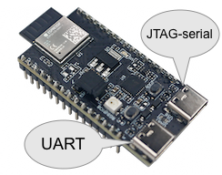

# ESP32/Rust on macOS

**..with focus on [Embassy](https://embassy.dev)**

Getting started with ESP32 Rust development, using macOS host (for IDE) and a Multipass VM (other tooling).

>Note: This repo builds upon [ESP32 on WSL](https://github.com/lure23/ESP32-WSL) (Windows and WSL; esp-idf; C/C++)

<!-- tbd. eventually, a schematics picture [[Excalidraw!]] on how it all falls in
- USB server (usbipd, driver)
- host (IDE)
- Multipass (Rust, Cargo)
- folder sharing

Have the diagram first, talk about connecting devices directly to Mac after.
-->

## Aim 🍏⛓️

- Minimal software installs on the host (Mac)
- Ability to flash <!--(and later, debug)--> the device from within Multipass VM

**Focus**

- RISC V only

   >If you want Xtensa-based chips covered, please sign up as a co-author. This one doesn't own the chips. :)

<!-- Editor's note:
   Support for Xtensa is slowly making itself to mainstream LLVM (within 2024?). Eventually a separate toolchain (`espup`) won't be needed. Even then, we should have a person with those chips checking that recipes continue to work.
   -->

- [Embassy](https://embassy.dev) async development

   Embassy is a *generational shift* in embedded programming. Its support for `async` without a separate RTOS makes concurrent programming linear to write. This is very similar to what Node.js did.

- Only stable Rust

	ESP32 (RISC V variants) Rust development is possible using the stable Rust (Jun'24). 


## Requirements

- Mac with:
   - [Multipass](https://multipass.run) installed

<details open><summary>**Alternative A. Connecting devices via Windows**</summary>

- Windows computer (Win10 Home is enough)
   - [`usbipd-win`](https://github.com/dorssel/usbipd-win) 4.2.0 (or later) installed
   - `CP210x universal Windows driver` (11.3.0) installed from [CP210x USB to UART Bridge VCP Drivers](https://www.silabs.com/developers/usb-to-uart-bridge-vcp-drivers) (SiLabs)
</details>

<details><summary>**Alternative B. Connecting devices via Raspberry Pi**</summary>

- See [`docs/rpi_usbipd.md`](docs/rpi_usbipd.md)
</details>

<details><summary>**Alternative C. Connecting devices directly to Mac**</summary>

Not recommended.

There's no good open source USB/IP server for macOS and Multipass doesn't have USB device management, unlike other VM solutions.

>If you want to do this, also consider that attaching solderable electronics to a computer always carries risks. The author sees it beneficial to have an air gap between the USB/IP server and the development machine! ⚡️
</details>

	
### Embedded hardware

The intention is to support as many common ESP32 (RISC V) development boards as possible. If you have access to boards not listed below, please consider giving a PR and/or becoming a co-author to the repo. 

**Warning!!**

*When powering the ESP32 boards for the first time, <font color=dark>**BEWARE OF THE STRONG LED LIGHT!!**</font> The author used a tape on top, until he reflashed the device. 😎🩹*

---

|board|hw version<sub>`[1]`</sub>|chip revision<sub>`[2]``[3]`</sub>|status|notes|
|---|---|---|---|---|
|**[ESP32-C3-DevKitC-02](https://docs.espressif.com/projects/esp-idf/en/stable/esp32c3/hw-reference/esp32c3/user-guide-devkitc-02.html)**|"1.1"|0.4|works with `espflash`|
|**[ESP32-C3-DevKit-RUST-1](https://www.espressif.com/en/dev-board/esp32-c3-devkit-rust-1-en)**|"1.2a&nbsp;(04/2022)"|0.4|works with `espflash`|
|**[ESP32-C6-DevKitM-1](https://docs.espressif.com/projects/espressif-esp-dev-kits/en/latest/esp32c6/esp32-c6-devkitm-1/user_guide.html)**|"1.0"|0.0|works with `espflash`||

<small>
`[1]`: version *physically printed* on the back side of the circuit board.

`[2]`: revision listed when running `espflash board-info` or restarting a board. This matters to some functionality, e.g. for C3 boards JTAG functionality (with added cable) is available for chip revisions >= 0.4.

`[3]`: Earlier documentation and bootloaders (from the ESP-IDF 4 era; up till Dec'22) mention chip revisions "3" and "4", they mean 0.3 and 0.4.
</small>

#### Board specific notes

The boards have USB connectors, but whether these are standard "USB+UART" (serial port) or connected to an integrated JTAG debugging circuitry varies.

||VID:PID|flashing|comms|debug|
|---|---|---|---|---|
|UART|`10c4:ea60`|&check;|&check;|-|
|JTAG|`303a:1001`|&check;|&check;|&check;|

You can use either port for programming, but need JTAG for interactive debugging. UART is the default for `esp-hal`. Below, we will cover both.

`VID:PID` are the device identifiers you'll see in USB access.

**ESP32-C3-DevKitC-02**

<!-- tbd. picture, just for the sake of it -->

The board has just one Micro-USB port. To gain access to JTAG, you need to solder a USB cable to the board. [Details here](https://docs.espressif.com/projects/esp-idf/en/v5.2/esp32c3/api-guides/jtag-debugging/configure-builtin-jtag.html)

|pin|USB|wire color|
|---|---|---|
|GPIO18|D-|⬜️|
|GPIO19|D+|🟩|
|5V|V_BUS|🟥|
|GND|Ground|⬛️|

<!-- tbd. image of a board with USB cable soldered -->


**ESP32-C3-DevKit-RUST-1**

<!-- tbd. picture, just for the sake of it -->

Has only JTAG connection (USB-C).


**ESP32-C6-DevKitM-01**

The dev board has two USB ports:



For now, **connect the cable to the "left"** (`uart`) port. This way, the default settings of `esp-hal` (we'll get there soon) will allow `println` messages to be see on the VM terminal.


<!-- 
Developed on:

Mac:
- macOS 14.5 (Intel)
- Multipass 1.14.0-rc1
- (CP210x device driver v. 6.0.2 optional; if running on single computer)

Windows:
- Windows 10 Home
   - CP210x universal Windows driver (11.3.0)
- usbipd-win v. 4.2.0
- WSL version 2.1.5.0 (> wsl --version); Ubuntu 22.04.4 LTS ($ lsb_release -a)
-->


## Prepare

### USB/IP sharing

- Set up USB/IP sharing according to instructions in the [ESP32-WSL](https://github.com/lure23/ESP32-WSL?tab=readme-ov-file#steps-set-up-usb-ip-bridging) (ignore the WSL parts of it).

	You should have:
	
	- `usbipd bind` exposing the dev board to the network
	- IP of the computer doing the sharing

### Multipass VM

We use a Multipass VM to keep the Rust development toolchain away from your main account. This is similar to using a dockerized workflow for development.

- Study the [`mp`](https://github.com/akauppi/mp) repo in detail!

	- Create the `rust-emb` instance within it.

<!-- disabled/REMOVE? (covered later)
### Work folder

We'll clone [`esp-rs/esp-hal`](https://github.com/esp-rs/esp-hal) since it has good examples to see that the development toolchain works (before going to Embassy).

Within the host:

- In folder of your choice:

   ```
   $ git clone -depth 1 git@github.com:esp-rs/esp-hal.git
   ...

	$ multipass stop rust-emb
	$ multipass mount --type=native esp-hal rust-emb:/home/ubuntu/esp-hal
	```

	The `esp-hal` folder now resides on your host, but can be accessed from the VM.

>Note: Mounting with `--type=native` provides "better performance" than default MP mounts, but requires the VM to be switched off while changes to the mounts are made. 	
-->

### Connecting the device to Multipass

We presume you have the USB/IP server running, and know the IP of the  machine (`192.168.1.29` below - replace with yours).

```
$ multipass shell rust-emb
```

>The following commands are to be given in the `rust-emb` VM.

1. Check that you can see the dev board (optional)

	```
   $ usbip list -r 192.168.1.29
	```
	
	<details><summary>**ESP32-C3-DevKitC-02**</summary>

   ```
   Exportable USB devices
   ======================
    - 192.168.1.29
           3-1: Silicon Labs : CP210x UART Bridge (10c4:ea60)
              : USB\VID_10C4&PID_EA60\BC2F214F809DED11AAFA5F84E259FB3E
              : (Defined at Interface level) (00/00/00)
              :  0 - Vendor Specific Class / unknown subclass / unknown protocol (ff/00/00)
   ```
   </details>

	<details><summary>**ESP32-C3-DevKit-RUST-1**</summary>

   ```
   Exportable USB devices
   ======================
	 - 192.168.1.29
	        3-1: unknown vendor : unknown product (303a:1001)
	           : USB\VID_303A&PID_1001\40:4C:CA:8D:9B:44
	           : Miscellaneous Device / ? / Interface Association (ef/02/01)
	           :  0 - Communications / Abstract (modem) / None (02/02/00)
	           :  1 - CDC Data / unknown subclass / unknown protocol (0a/02/00)
	           :  2 - Vendor Specific Class / Vendor Specific Subclass / unknown protocol (ff/ff/01)
	```
   </details>

	<details><summary>**ESP32-C6-DevKitM-1 (`uart`)**</summary>

   ```
	Exportable USB devices
	======================
	 - 192.168.1.29
	        3-1: Silicon Labs : CP210x UART Bridge (10c4:ea60)
	           : USB\VID_10C4&PID_EA60\3086768A3759ED11B797B7301D62BC44
	           : (Defined at Interface level) (00/00/00)
	           :  0 - Vendor Specific Class / unknown subclass / unknown protocol (ff/00/00)
	```
	</details>

	<details><summary>**ESP32-C6-DevKitM-1 (`JTAG-serial`)**</summary>

   ```
	Exportable USB devices
	======================
	 - 192.168.1.29
	        3-1: unknown vendor : unknown product (303a:1001)
	           : USB\VID_303A&PID_1001\54:32:04:07:15:10
	           : Miscellaneous Device / ? / Interface Association (ef/02/01)
	           :  0 - Communications / Abstract (modem) / None (02/02/00)
	           :  1 - CDC Data / unknown subclass / unknown protocol (0a/02/00)
	           :  2 - Vendor Specific Class / Vendor Specific Subclass / unknown protocol (ff/ff/01)
	```
	</details>
   
2. Attach the dev board to your VM

   ```
   $ sudo usbip attach -r 192.168.1.29 -b 3-1
   ```

3. Now you should see it in the device tree:

   ```   
   $ lsusb
   ```
   
	<details><summary>**ESP32-C3-DevKitC-02**</summary>

	```
   Bus 002 Device 001: ID 1d6b:0003 Linux Foundation 3.0 root hub
   Bus 001 Device 009: ID 10c4:ea60 Silicon Labs CP210x UART Bridge
   Bus 002 Device 001: ID 1d6b:0003 Linux Foundation 3.0 root hub
   ```
	</details>

	<details><summary>**ESP32-C6-DevKitM-1 (`uart`)**</summary>

	```
	Bus 001 Device 001: ID 1d6b:0002 Linux Foundation 2.0 root hub
	Bus 001 Device 007: ID 10c4:ea60 Silicon Labs CP210x UART Bridge
	Bus 002 Device 001: ID 1d6b:0003 Linux Foundation 3.0 root hub
	```
	</details>
	
	<details><summary>**ESP32-C6-DevKitM-1 (`JTAG-serial`)**</summary>

	```
	Bus 001 Device 001: ID 1d6b:0002 Linux Foundation 2.0 root hub
	Bus 001 Device 003: ID 303a:1001 Espressif USB JTAG/serial debug unit
	Bus 002 Device 001: ID 1d6b:0003 Linux Foundation 3.0 root hub
	```
	</details>

4. Check with `espflash`

	```
	$ espflash board-info
	```

	<details><summary>**ESP32-C3-DevKitC-02**</summary>

	```
	[2024-06-03T11:27:27Z INFO ] Serial port: '/dev/ttyUSB0'
	[2024-06-03T11:27:27Z INFO ] Connecting...
	[2024-06-03T11:27:28Z INFO ] Using flash stub
	Chip type:         esp32c3 (revision v0.4)
	Crystal frequency: 40 MHz
	Flash size:        4MB
	Features:          WiFi, BLE
	MAC address:       54:32:04:41:7d:60
   ```
	</details>

	<details><summary>**ESP32-C6-DevKitM-1 (`uart`)**</summary>

	```
	[2024-06-03T11:00:18Z INFO ] Serial port: '/dev/ttyUSB0'
	[2024-06-03T11:00:18Z INFO ] Connecting...
	[2024-06-03T11:00:18Z INFO ] Using flash stub
	Chip type:         esp32c6 (revision v0.0)
	Crystal frequency: 40 MHz
	Flash size:        4MB
	Features:          WiFi 6, BT 5
	MAC address:       54:32:04:07:15:10
	```
	</details>
	
	<details><summary>**ESP32-C6-DevKitM-1 (`JTAG-serial`)**</summary>

	```
	[2024-06-03T11:25:36Z INFO ] Serial port: '/dev/ttyACM0'
	[2024-06-03T11:25:36Z INFO ] Connecting...
	[2024-06-03T11:25:36Z INFO ] Using flash stub
	Chip type:         esp32c6 (revision v0.0)
	Crystal frequency: 40 MHz
	Flash size:        4MB
	Features:          WiFi 6, BT 5
	MAC address:       54:32:04:07:15:10	
	```
	</details>

	Info: `espflash` is one of the commands you can use for interacting with the device (flashing and seeing its info).
	

5. Check with `probe-rs`

	```
	$ probe-rs list
	```
	
	<details><summary>**ESP32-C3-DevKitC-02**</summary>

	```
	No debug probes were found.
	```
	</details>

	<details><summary>**ESP32-C6-DevKitM-1 (`uart`)**</summary>

	```
	No debug probes were found.
	```
	</details>

	<details><summary>**ESP32-C6-DevKitM-1 (`JTAG-serial`)**</summary>

	```
	The following debug probes were found:
	[0]: ESP JTAG -- 303a:1001:54:32:04:07:15:10 (EspJtag)
	```
	</details>


## Run some examples from `esp-hal`

>**Background**: The [esp-hal](https://github.com/esp-rs/esp-hal) repo (Hardware Abstraction Layer) has code that allows using the ESP32 hardware from Rust. It also includes an `examples` folder that we'll look into.


### Clone

Let's clone the [`esp-hal`](https://github.com/esp-rs/esp-hal) repo to your host (Mac):

```
$ git clone --depth 1 git@github.com:esp-rs/esp-hal.git
```

>`--depth 1` excludes history; we don't need it and same some disk space

### Share the folder with VM

```
$ multipass stop rust-emb
$ multipass mount --type=native esp-hal rust-emb:/home/ubuntu/esp-hal
```

>Note: We don't need to enter the `esp-hal` folder on the host side. Just sharing it with the VM.

Now you have `esp-hal` available within the VM. 

>Note: Unfortunately, using `--type=native` requires the VM to be shut down when adding/removing mounts. On the other side, it promises better performance than default Multipass mounts. The folder is huge (ca. 1.9GB) so we like to have the performance!!

### Restart the VM

```
$ multipass shell rust-emb
```

Within the VM, re-attach the development kit. It was lost when we restarted the VM.

```
$ sudo usbip attach -r 192.168.1.29 -b 3-1
```

### Build

Within the VM:

```
$ cd esp-hal
```

>Study the [`esp-hal/examples/`](https://github.com/esp-rs/esp-hal/tree/main/examples/) folder. 
>
>This is a treasure trove of dealing with different sensors. To begin with, we just build (and run) the `hello_world` example.

<!-- tbd...?
-- here about editing `Cargo.toml` **IF** this helps with the console output:
   
#esp-println         = { path = "../esp-println", features = ["log"] }  // WAS 2-Jun-24
esp-println         = { path = "../esp-println", default-features=false, features = ["log", "jtag-serial", "defmt-espflash"] }
-->

Within the `esp-hal` folder in the VM:

```
$ cargo xtask run-example esp-hal esp32c6 hello_world
```

Output:

<details><summary>**ESP32-C3-DevKitC-02**</summary>

```
...
Hello world!
Hello world!
```
</details>

<details><summary>**ESP32-C6-DevKitM-1 (`uart`)**</summary>

```
...
Hello world!
Hello world!
```
</details>

<details><summary>**ESP32-C6-DevKitM-1 (`JTAG-serial`)**</summary>

```
...
I (112) esp_image: segment 3: paddr=00017614 vaddr=40800020 size=00eech (  3820) load
I (120) boot: Loaded app from partition at offset 0x10000
```

(no output)

See the devkit specific appendix for an explanation.

Since console output only goes to `uart`, it's probably best to move to using that port, for further examples. <!-- tbd. ideally, we'd tell here how to enable the output -->
</details>


### More samples

To see which samples are suitable for e.g. `esp32-c6`: 

```
$ git grep -P "(?<=% CHIPS:).*esp32c6" examples/src/
```

That gives 82 (65 for C3) matches! 😃

<!-- tbd. #later show some 2 examples; now FWD to Embassy!
	// didn't get 'println' output from ADC; no blinks with Blinky
	
#### ADC
...
-->

<!-- tbd. Doesn't blink the *internal* LED; fix that?
#### Blinky 🚨

Leaving the lack of `println` visibility behind, let's check:

```
$ cargo xtask run-example esp-hal esp32c6 blinky
```

-->

## Embassy!

The `esp-hal` and [`embassy`](https://github.com/embassy-rs/embassy) repos seem to be arranged so (for ESP32, that is) that we don't need to switch repos. The examples for Embassy are within [`esp-hal/examples/src/bin/`](https://github.com/esp-rs/esp-hal/tree/main/examples/src/bin) `embassy_*.rs` (18 of them).

This is good. 

>What's special about Embassy? It harnesses the `async`/`await` mechanism, making creating *concurrent* embedded code *easy* to write. This is brilliance - see [Embassy.dev](https://embassy.dev) for more details or just hang on and let's give it a try! ☀️


```
$ cargo xtask run-example esp-hal esp32c6 embassy_hello_world
```

<details><summary>**ESP32-C3-DevKitC-02**</summary>

```
Init!
Bing!
Hello world from embassy using esp-hal-async!
Hello world from embassy using esp-hal-async!
```
</details>

<details><summary>**ESP32-C6-DevKitM-1 (`uart`)**</summary>

```
...
Init!
Bing!
Hello world from embassy using esp-hal-async!
Hello world from embassy using esp-hal-async!
```
</details>

<details><summary>**ESP32-C6-DevKitM-1 (`JTAG-serial`)**</summary>

```
...
Init!
Bing!
Hello world from embassy using esp-hal-async!
Hello world from embassy using esp-hal-async!
```
</details>

**About `JTAG-serial` and `defmt` logging**

The above example was able to be run also on C6 `JTAG-serial`, with a one line configuration change in `examples/Cargo.toml`:

```diff
-esp-println         = { path = "../esp-println", features = ["log"] }
+esp-println         = { path = "../esp-println", default-features=false, features = ["log", "jtag-serial", "defmt-espflash"] }
```

The default (that works for C3 and C6 `uart`) is targeting `uart`. Here, we prevented default features (`default-features=false`) and manually chose output to go to `jtag-serial`.

In addition - and this may be useful for any target - `defmt-espflash` was enabled. You can [read online more](https://defmt.ferrous-systems.com) about `defmt`; in short it makes logging easier on the embedded side, causing smaller binary sizes. It's a Good Thing but needs support from the development toolchain. Which we seem to have.

All this works because the `embassy_hello_world` uses `esp_println::println!` for its output.

### Other samples

Now is a good time to check through the other 24 `*embassy_*.rs` samples (note that wifi ones start with `esp_wifi_embassy`).


## What's so great about Embassy?

It just helps you code embedded in the *right* and *efficient* way. If all your code are `await`ing something, it means the Embassy scheduler has placed the CPU to sleep mode. These are details you just don't need to be concerned of.

This author sees a bright future for the Embassy project, and now You can be part of it!


## Outcome

We set out to create a development toolchain with the following aims:

- Minimal software installs on the host (Mac)
- Ability to flash the device from within Multipass VM

This was reached. :) You can now extend the reach by studying and modifying the other Embassy examples, and bringing your electronics and motor skills to the game!

This is probably a good place to stop the repo. It is doing its service if it made it easy for you to step in. Please **spread the word** and if you find any mistakes - or have other ESP32 boards you would like to be featured - chime in!

The plans of the author can be seen in the repo's [Issues](https://github.com/lure23/ESP32-Mac/issues) section.

Happy Riscing! 🎉

<!--
Make great things!
-->

## Q/A & Hints

### How does `probe-rs` find a development board?

>Note the `303a:1001` in e.g. the `lsusb` output. These are the "vendor id" and "product id" of your board. 

They match a line in the `udev` rules file used by `probe-rs`:

```
$ cat /etc/udev/rules.d/69-probe-rs.rules | grep 303a | grep 1001
ATTRS{idVendor}=="303a", ATTRS{idProduct}=="1001", MODE="660", GROUP="plugdev", TAG+="uaccess"
```

### How to make the VM more performant?

You can increase the number of cores Multipass is allowed to use by:

- `multipass stop rust-emb`
- `multipass set local.rust-emb.cpus={X}`

Then `multipass shell rust-emb` to get back in action.


## DevKit specific

### ESP32-C3-DevKitC-02

The device has a single USB port. From chip revisions 0.3 onwards, it *does* also have JTAG circuitry, but enabling this needs soldering a USB cable to the device.

<!-- tbd. Excalidraw diagram here on the pins to connect
-->

>The ESP32-C3 Devkit C doesn't expose the JTAG interface over USB by default, see the [ESP32-C3 debugging docs](https://docs.espressif.com/projects/esp-idf/en/latest/esp32c3/api-guides/jtag-debugging/configure-builtin-jtag.html) to configure the board for debugging or consider using the esp32c3-rust-board instead. <sub>[source](https://github.com/esp-rs/book/blob/main/src/tooling/debugging/index.md#usb-jtag-serial-peripheral)</sub>

*Tried this, and it works. However, what benefits JTAG really brings over UART needs to be studied..* <!-- tbd. when would one benefit from the soldering?  `probe-rs` debugging, likely -->

### ESP32-C3-DevKit-RUST-1

Be aware before purchasing:

This board contains some peripherals to get started easier. Having Rust in its name seems enticing. It's intended for educational purposes.

However:

- its availability may be worse than the other two
- it comes without pins soldered so you must add those before using on a breadboard
- anecdotally, the author's board cost 50 euros (**about 5x more than the others!**) 
- ..and he needed to fill all kinds of *export forms* that weren't needed by the other, computationally similar boards.

This is the kind of logistics friction we can do without. The shopping and using experience with the other two boards was smooth, in comparison!

<!-- Purchased in 2024 via Mouser. Shipped from the US. -->


### ESP32-C6-DevKitM-1

As already mentioned, the kit has two USB ports, `uart` and `JTAG-serial`. Programming works on both, but passing the console (`println`) output is by default sent to the `uart` port.

- See above on how to steer the output to `uart` vs. `jtag-serial`, based on your needs.

- [ ] What are the benefits of such dedicated JTAG connection?  (debugging; try and tell) *tbd.*


## References

- [Embedded Rust (`no_std`) on Espressif](https://docs.esp-rs.org/no_std-training/02_2_software.html)
